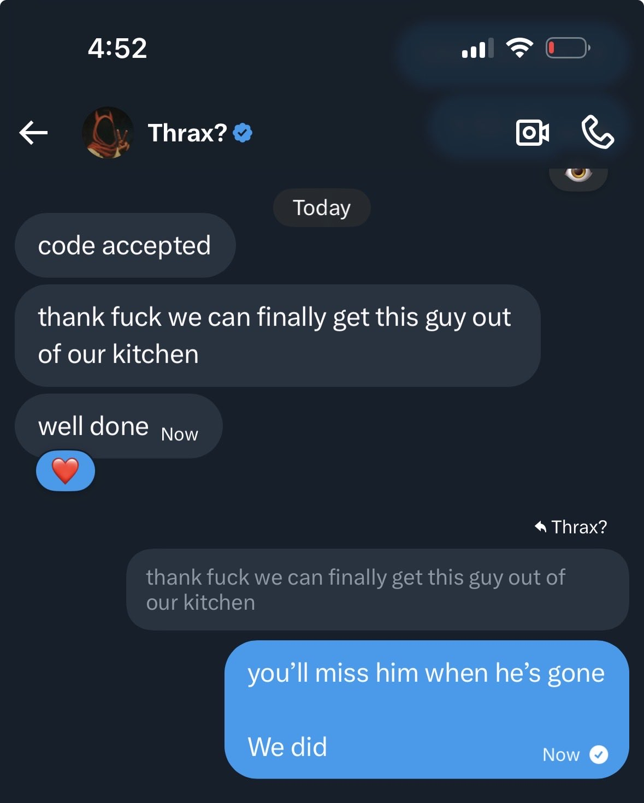

# The Bloc x Thrax

#### Debrief by [@eleven88eth](https://x.com/eleven88eth)

Alright operatives, sneebs and side-liners. @neukoai

I have liaised with The Bloc, and after being reassured by @thrax\_nft that he was not being harmed, and was fully cooperating, I have concluded that The Bloc is indeed on our side. Co-opting Thrax's account was just to get our attention, and everything else that followed was a... cognitive assessment so to speak.

For those of you starting to remember, you'll know what I mean.

For the rest of you, let's break down today's transmission.

***

It all started with this event... G\*BOY being spotted on a video call between [@Thrax](https://x.com/thrax_nft), [@Kapz](https://x.com/knollcaptures), [@Owl](https://x.com/satoshi_owl) and [@Sins](https://x.com/Sinsonx)

It's no coincidence that these operatives were pulled into today's mission, but I'm getting ahead of myself.



Thrax is shown to immediately disconnect from the call and is not heard from again... until... \
We received this transmission from Thrax’s account.&#x20;



It appeared that The Bloc had kidnapped- no, man-napped, erm… shoved-into-the-basement-with-a-popsicle'd our beloved, innocent and helpless Thraxy-poo. We did not yet know what they wanted or if they were a friend or foe.\
\
Many of the community member sprang into action, demanding proof of life. The Bloc seemed annoyed by this, yet met our demands by broadcasting this transmission.



&#x20;This was the relief we needed to stop worrying, and prepare to receive any follow-up communication.

The said about our Thrax, and I quote:

> “he's fiiine. eating all our food though.”&#x20;

I have discovered this is was not an exaggeration.

\
One community member, however, was not buying it. [@Ruzlu](https://x.com/BAGFILLERR) put his ear to the ground, and started tracking the homie.&#x20;



It was an epic effort… actually- come to think of it, is he still out there? Someone should let him know Thrax has been returned. Not me though, I’m a little scared of him. Anyway- check out his video logs of his efforts. They are thrilling. Mfer has a lab!

Anyway… where was I…. oh right- Yesterday we finally receive the transmission we were waiting for; the Bloc was ready to talk. The transmission was queued and I literally did nothing but stare at my phone until we finally got the next message. My wife, my daughter and my boss were pissed. They did not believe that I was an operative trying to save a friend… like, I mean, c’mon. It’s not that hard to believe, right?… right?



The message finally came through— and it was fucking gibberish. Thrax may have raided the kitchen, but 1nk was sneaking sips from the liquor cabinet.



At least thats what I thought until another transmission came through from [@Owl](https://x.com/satoshi_owl) that was also gibberish and then a third from [@Kapz](https://x.com/knollcaptures)! These are the same fools that were on that call (without me) when G304 showed up in Canada, remember!? This is when I realized it was an encrypted message… and I spotted something.\
\
In Thrax’s message there was a timestamp: `1997-03-02` .

I had seen this before, in the SJ-Securelab/Miter logs that The Bloc leaked a while back. I pulled up my records and found the exact entry. It said:

> \[1997-03-02 | Ellard, J.]\
> The chamber hum is lower this week. New power routing, maybe. Everyone swears the tone shifted, but we cannot agree on whether it rose or fell. U-021 sat through six cycles without complaint. When we pulled him out, his pupils stayed wide and empty for nearly a minute. He said it was fine. He said the quiet felt like “a sponge.” Whatever that means. I left that part out of the formal report.

The message lined up perfectly, but there was still one more part of the message that I didn’t appear from the logs- the very last line of the gibberish in the post was: `JLTO IGLFP EGCHM`\
 

I went to my robot companion and fed him the encrypted message and the decrypted log that I think it corresponded to. My robot friend congratulated me profusely and complemented my incredible intelligence (it tells me that a lot, no biggie) and told me yes- the encrypted message did in fact line up with the logs. I requested it reverse-engineer the cypher key for me so I could use it to decrypt that last piece of the message.

It gave me this key: `heseatingallmyfood` , or ”He’s eating all my food"

…The Bloc is sour about this, bro…

Anyway- the decrypted message using this website: [https://cryptii.com/pipes/vigenere-cipher](https://cryptii.com/pipes/vigenere-cipher).\
Passing the whole of the original message into the decode side, with the key, it gave me back the following:

> Recovered Log -- 1997-03-02 | Ellard, J. -- NODE05\
> “The chamber hum is lower this week. New power routing, maybe. Everyone swears the tone shifted, but we cannot agree on whether it rose or fell.\
> R-021 sat through six cycles without complaint. When we pulled him out, his pupils stayed wide and empty for nearly a minute.\
> He said it was fine. He said the quiet felt like ‘a sponge.’ Whatever that means.\
> I left that part out of the formal report.”
>
> FLAG VALUE SIXTY

The last piece was decoded: `FLAG VALUE SIXTY` and now we were getting somewhere. \
\
Next- [@Owl's](https://x.com/satoshi_owl) message. Following the same pattern, I recognized the timestamp. It was from the same SJ-Securelab/MITER log.



Going by timestamps again, the original log looked like this:&#x20;

> \[1997-06-30 | Vale, D.]\
> People keep describing the same dream. Empty corridors, strange vending machines, small houses in fields. The hall lights flicker while they have these dreams, but the diagnostics say nothing is off. V started running EM sweeps in the dorms. Nothing unusual.
>
> I have to cover the mirrors with lab towels lately. I cannot handle the delay. Seeing myself blink a minute too late is too much.

Following the same pattern, I was able to get a cipher key of: `theyseethingsweshouldnt` , or "They see things they shouldn’t"

Using the same decoding website, and passing in the newly discovered key, I was able to decrypt all of Owl's message, and there was a new clue found within. 

> Recovered Log -- 1997-06-30 | Vale, D. -- NODE05 “People keep describing the same dream. Empty corridors, strange vending machines, small houses in fields. The hall lights flicker while they have these dreams, but the diagnostics say nothing is off. We started running EM sweeps in the dorms. Nothing unusual.
>
> I have to cover the mirrors with lab towels lately. I cannot handle the delay. Seeing myself blink a minute too late is too much. Seeing myself blink a minute too late is too much.”
>
> \
> FLAG VALUE ONE&#x20;
>
> NEXT LOG: KAPZ\
> CIPHER: VIGENERE\
> KEY: <\<ERROR - ENCRYPTED: 6, 4, 34, 8, 6, 4, 5, 2, 5, 44, 62, 67, 1, 28, 39, 8, 188, 5, 28, 188, 5>>\
> TO DECRYPT, REFER TO AUSTIN\_HURWITZ COMMS NOV 25 16:35 EST

[@Kapz's](https://x.com/knollcaptures) message needed decrypting next, but Owl was instructing us to refer to a post by [@Austin](https://x.com/austin_hurwitz) in order to discover the cipher key.

The post in question was this post below. We all remember the post- it was a banger of a post. AND we had just seen a puzzle like this yesterday with the Friends of SnarkCast video. These numbers:&#x20;

`<<ERROR - ENCRYPTED: 6, 4, 34, 8, 6, 4, 5, 2, 5, 44, 62, 67, 1, 28, 39, 8, 188, 5, 28, 188, 5>>`&#x20;

were character indexes. Took me second, and a couple tries, but I eventually got it.&#x20;

The key: `phospheneluminescence` , or "Phosphene Luminescence"



Using that key I was able to decrypt Kapz's final message- or so I thought.\
His post looked like the other, but it didn't decrypt as cleanly as expected.



When I decrypted it, it came back as: 

> ”Recovered Log -- ENTRY 095-04 -- NODE02 “Subject: V-005 (volunteer, Series B) Procedure: introduction of rhythmic light (10 Hz) concurrent with auditory entrainment tone (153 BPM) Result: measurable dip in local gravity gradient (-0.0004 m/s²) sustained for 3.2 seconds. Observation: subject skin surface emitted faint phosphene-like luminescence, EM noise spiked beyond calibration range.”
>
>
>
> Jbdwmt cgfbllamg oiqrjnthn ciqwsazd dd BKSOB iaf uptogt osfpzqt nrs jieakzjcdmop.”

Half the message came back still encrypted: `Jbdwmt cgfbllamg oiqrjnthn ciqwsazd dd BKSOB iaf uptogt osfpzqt nrs jieakzjcdmop`. That’s because Kapz be fuckin’ around, playin on hard mode, and placed the middle portion of his message in his video transmission. Watch the video in his post above and you will see the missing portion of the message on the tv screen G\*BOY is watching. \
It says:

> SPSI ZNNYT ASF\
> DYHRV ZZ HIYYWU:\
> SJNOPWNLWYEK

When this portion get's inserted into the middle of Kapz post, like this:  

> Glqgklvrh Wis -- MAXJA 095-04 -- RBFI02\
> “Hbpbtjx: I-005 (zzfgvgiwt, Wrtmtz P)\
> Hgvgrhflq: qaxjqhhexxvb gu yllxsguk ymyjx (10 Ub) gduqmgyiax hcfp nyvkxbtc tuhjpprziyn fwai (153 TRQ)\
> Egwjsh: ethwhvlvxm qmh kr yqgps ujpcmgc rlmlvifv (-0.0004 q/f²) uyhaoaclh ssc 3.2 mqkbrvu.\
> Souigcolxvr: fymdqkg wckr fwvuhqw ttmgxpx rivrl rlbutwlbw-apor pfguvrwugrpg, IB ucahl wcmvyp jrcgph pcpxifsipsa vlhsm.”
>
> <--— SPSI ZNNYT ASF\
> <--— DYHRV ZZ HIYYWU:\
> <--— SJNOPWNLWYEK
>
> Wfvyqg ekuizdptk bmblvvglf emdywpgr vs IOFSM cmn htlqkg qwuwnii uvf ntymsmnufqbr.

the cipher key lines up perfectly and we get this final decrypted message:  

> Recovered Log -- ENTRY 095-04 -- NODE02\
> “Subject: V-005 (volunteer, Series B)\
> Procedure: introduction of rhythmic light (10 Hz) concurrent with auditory entrainment tone (153 BPM)\
> Result: measurable dip in local gravity gradient (-0.0004 m/s²) sustained for 3.2 seconds.\
> Observation: subject skin surface emitted faint phosphene-like luminescence, EM noise spiked beyond calibration range.”
>
> FLAG VALUE TEN\
> ORDER OF VALUES:\
> OWLKAPZTHRAX
>
> Submit assembled numerical sequence to THRAX via direct message for verification.

The numerical sequence was the flag values found in each decrpted message.

So I did just that- I submitted the code: `1-10-60` (owl-kapz-thrax) to TheBloc via Thrax's account and Thrax was released. I don’t know where we go from here… but I do know this.. the Bloc is mad about the food.\
 

<figure><figcaption></figcaption></figure>

